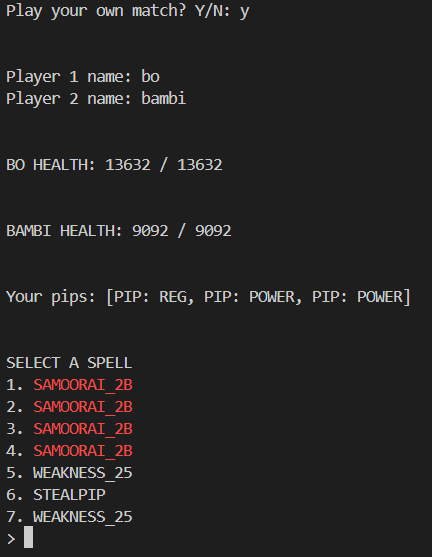
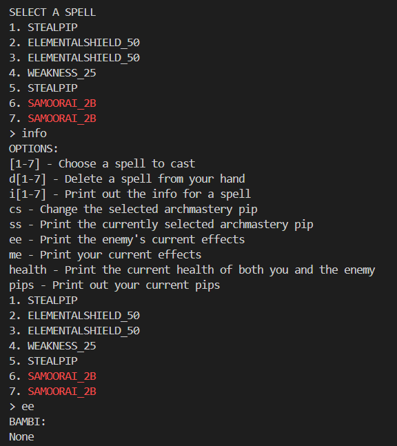
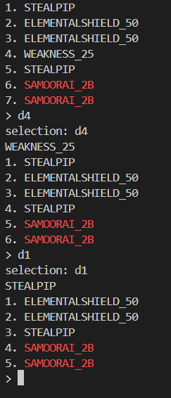
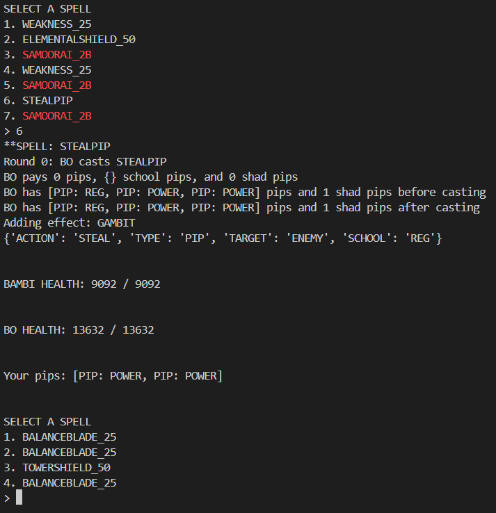
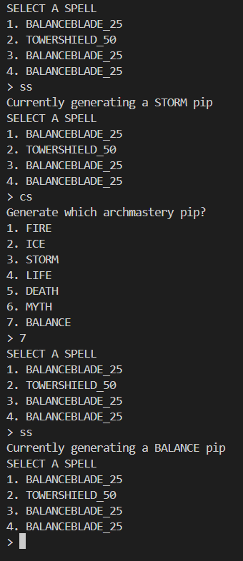
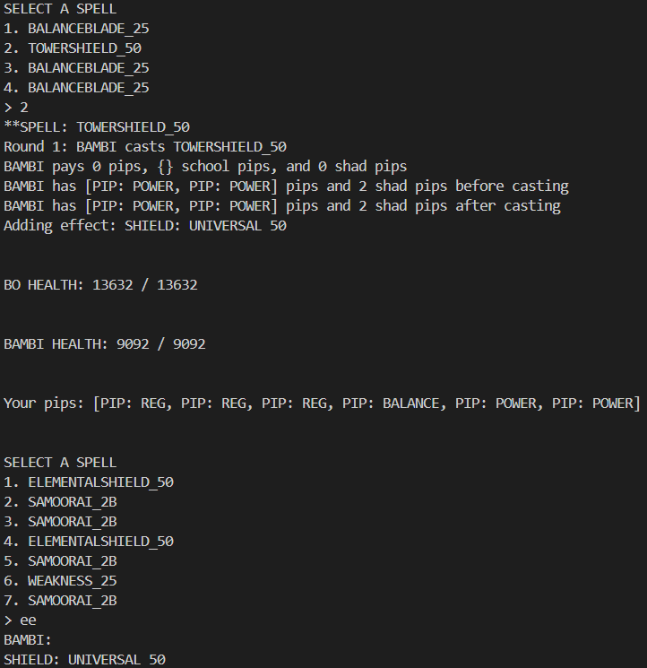

# Wizard101 PvP simulator
A Python simulator that models Wizard101 PvP battles, including a spell system, effect processing system, and framework for machine learning.

## Current Status

This project is in active development! The following features have been completed/planned so far:

[✓] single/ranged damage

[✓] bubbles

[✓] auras

[✓] backlash

[✓] charms

[✓] wards

[✓] DOTs

[✓] bomb DOTs

[x] heals

[x] HOTs

[-] detonates

[✓] pips

[x] archmastery
So far, archmastery pips have been included, though no formula has been implemented

[x] pip conserve
TODO: pip conserve formulation

[-] shadow pips
These exist, but no formula has been implemented

[x] heal blades/traps

[-] pierce

[x] pierce blades

[x] critical

[x] block

[-] minions

[x] Monte Carlo tree search

[x] heuristic evaluation

[x] graphical user interface

[-] spell database

[x] deck-building interface

## Progress

### Start of a custom battle:

---

### All the decisions the user can make on a given turn:

---

### The user deleting a spell on their turn:

---

### Casting a gambit spell

---

### Changing the selected school pip

---

### Adding an effect to player after casting a spell

---

You can find all kinds of info on this project in /docs/. Because this is unfinished, I've included explicit development updates there, as well as photos of how the project is going during local testing.